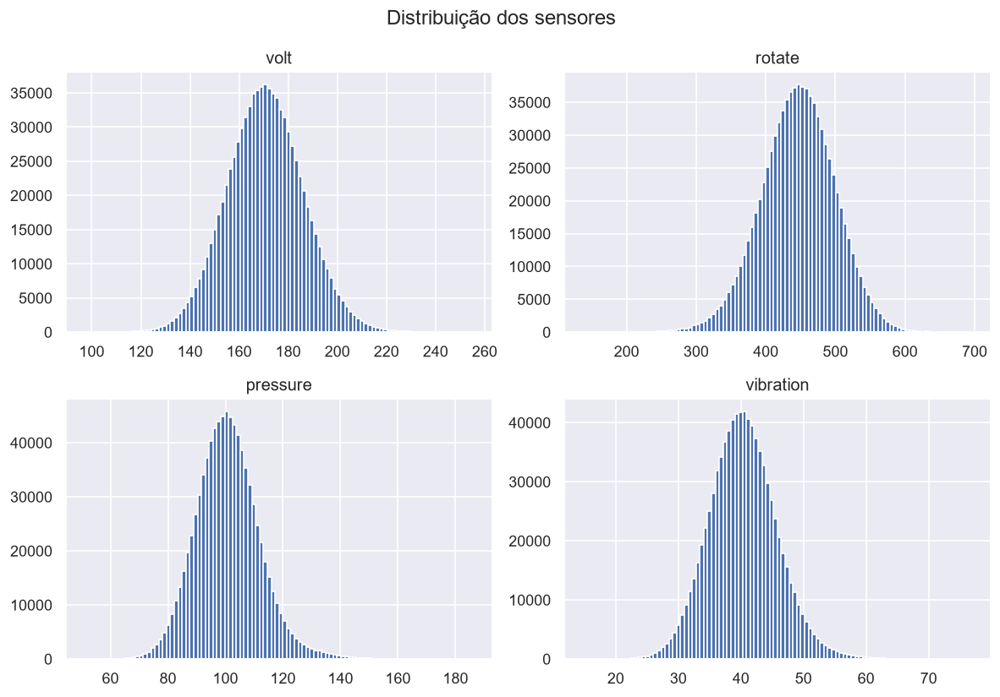
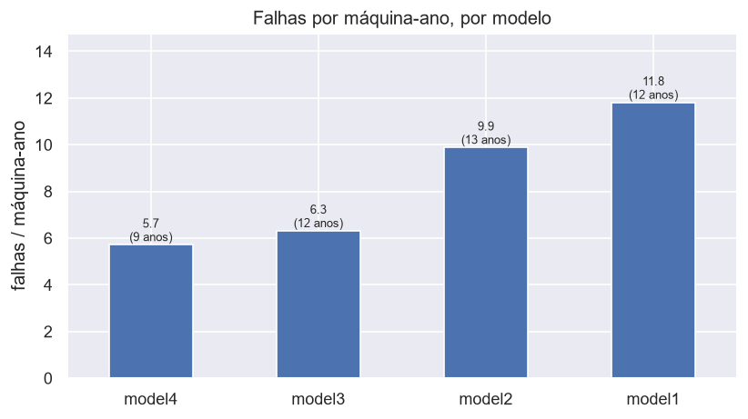
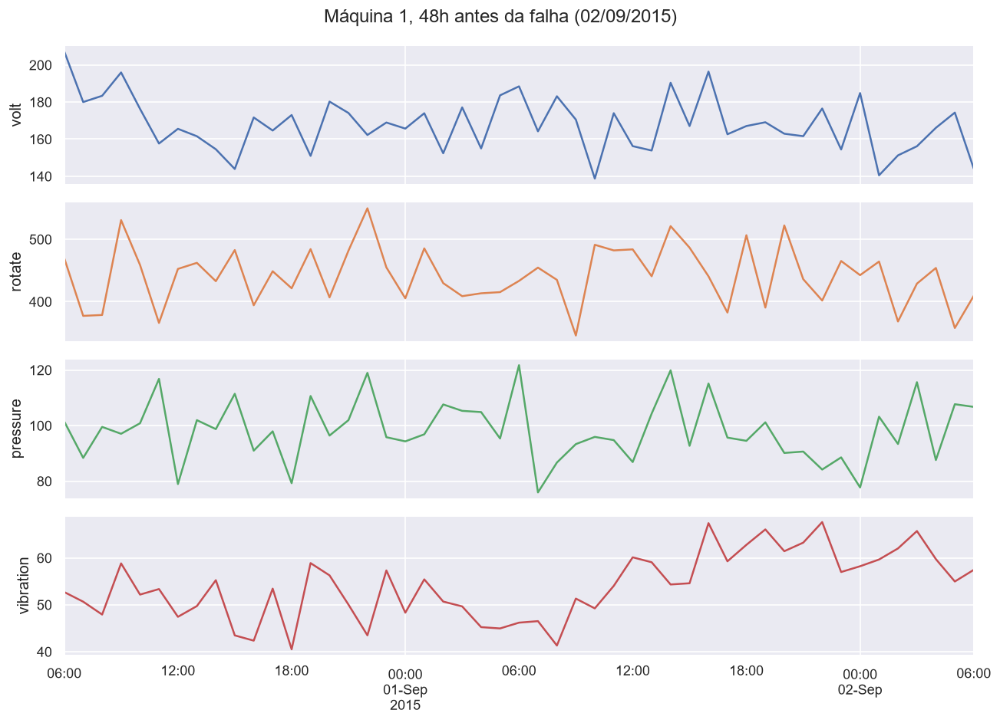
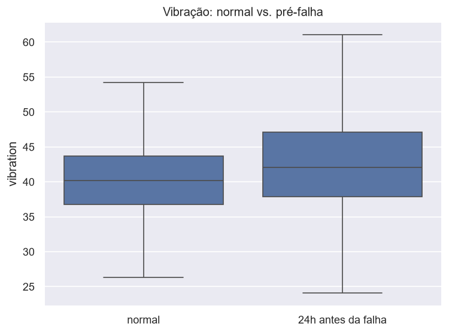

# P03. Explorando dados de sensores industriais

Análise exploratória de um ano de telemetria de 100 máquinas industriais. A pergunta que guia
o projeto é simples: os sensores mudam de comportamento antes de uma falha? Se mudam, dá pra
construir um modelo de manutenção preditiva; se não, a falha é imprevisível a partir desses
dados.

## Os dados

Dataset *Microsoft Azure Predictive Maintenance* (público, Kaggle). É um dataset sintético,
feito para ensinar manutenção preditiva, então não são dados de uma fábrica real. São cinco
tabelas ligadas pela máquina (`machineID`) e pelo horário (`datetime`):

| Tabela | Conteúdo | Linhas |
|---|---|---|
| `PdM_telemetry` | Leitura horária de 4 sensores: tensão, rotação, pressão, vibração | 876.100 |
| `PdM_errors` | Erros registrados (a máquina segue operando) | 3.919 |
| `PdM_failures` | Falhas de componente (parada e troca) | 761 |
| `PdM_maint` | Trocas de componente (preventivas e corretivas) | 3.286 |
| `PdM_machines` | Modelo e idade de cada máquina | 100 |

Os `.csv` não estão no repositório (ver `.gitignore`). Para rodar, baixe o dataset do Kaggle e
coloque os cinco arquivos em `data/`.

## Como rodar

```bash
pip install pandas numpy matplotlib seaborn jupyter
# baixar o dataset do Kaggle e extrair os 5 CSVs em data/
jupyter notebook notebooks/P03_exploracao_sensores.ipynb
```

## O que a análise mostrou

### Sensores estáveis e independentes em operação normal

Os quatro sensores têm distribuição perto de uma gaussiana em torno de um valor de operação, e
a correlação linear entre eles no ano todo é praticamente nula. Cada sensor carrega informação
própria.



### A confiabilidade depende do modelo, não só da idade

Normalizando pelo número de máquinas de cada modelo, o model1 e o model2 falham quase o dobro
do model3, mesmo com idade média praticamente igual (~12 anos). O model4 tem a menor taxa, mas
é o mais novo da frota (~9 anos), então esse resultado fica confundido com o efeito da idade e
não dá pra afirmar.



Outros números: a taxa de falha é de umas 7,6 por máquina-ano; o `comp2` concentra 34% das
falhas; duas máquinas passaram o ano sem falhar e outra falhou 19 vezes; cerca de 77% das
manutenções são preventivas.

### A falha avisa antes, principalmente na vibração

Recortando as 48 h antes de uma falha da máquina 1, a vibração sai de ~45 e chega a ~70 nas
últimas 15 h, e a pressão também sobe um pouco. Numa janela de controle da mesma máquina, sem
falha por perto, tudo fica plano.



O padrão se mantém no agregado. Marcando toda leitura que cai nas 24 h anteriores a qualquer
uma das 761 falhas e comparando com as horas normais, a média dos sensores desloca de forma
coordenada: vibração e pressão pra cima, rotação pra baixo, na ordem de meio desvio-padrão
mesmo diluído na janela inteira.



Os erros também antecipam a falha: 705 das 761 falhas (93%) têm pelo menos um erro registrado
nas 24 h anteriores, contra os ~80 que cairiam nessa janela se fossem aleatórios.

## Conclusão

Existe degradação mensurável e antecipada à falha nesse dataset, sobretudo na vibração,
começando cerca de um dia antes e se intensificando nas horas finais. Um modelo de manutenção
preditiva é viável. Como ponto de partida, usaria média e desvio móvel de 24 h da vibração e
da rotação, mais a contagem de erros recentes, com alvo "vai falhar nas próximas 12 a 24 h".

O próximo projeto do portfólio é um pipeline de limpeza para dados de sensores realmente
sujos, e mais adiante o modelo preditivo em si.
