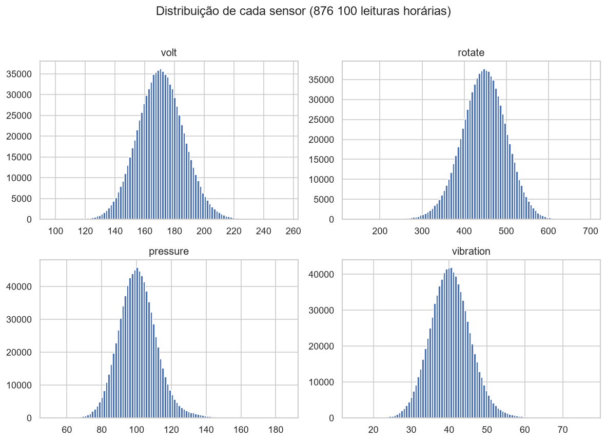
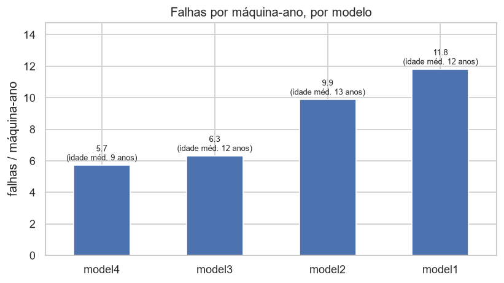
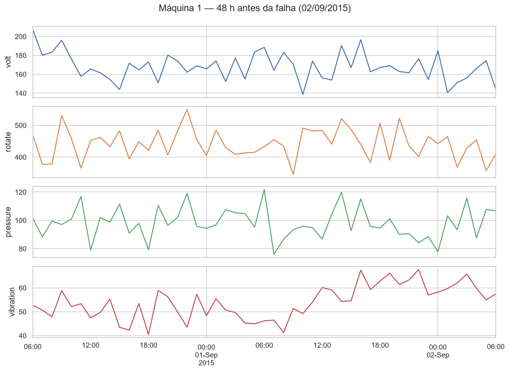
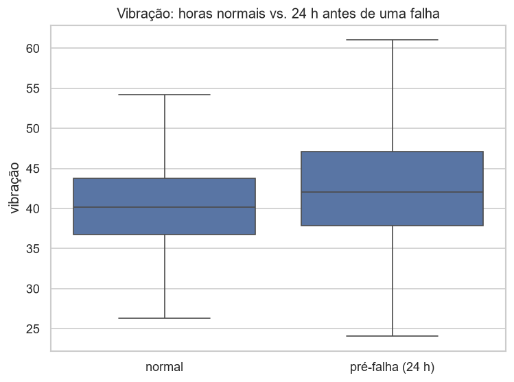

# P03 — Explorando dados de sensores industriais

Análise exploratória de um ano de telemetria de **100 máquinas industriais**, com o objetivo
de responder uma pergunta prática de manutenção: **os sensores mudam de comportamento antes
de uma falha?** Se mudam, manutenção preditiva é viável; se não, a falha é imprevisível a
partir dos dados disponíveis.

## Contexto

Trabalho no papel de analista de uma equipe de confiabilidade. Antes de qualquer modelo, é
preciso entender os dados: o que os sensores medem, como se comportam em operação normal, com
que frequência as máquinas falham e se a falha "avisa" antes de acontecer.

## Dados

Dataset *Microsoft Azure Predictive Maintenance* (público, Kaggle) — **sintético, de uso
didático**. Cinco tabelas relacionadas pela máquina (`machineID`) e pelo horário (`datetime`):

| Tabela | Conteúdo | Volume |
|---|---|---|
| `PdM_telemetry` | Leitura horária de 4 sensores: tensão, rotação, pressão e vibração | 876 100 linhas |
| `PdM_errors` | Erros registrados (máquina segue operando) | 3 919 |
| `PdM_failures` | Falhas de componente (parada + troca) | 761 |
| `PdM_maint` | Trocas de componente (preventivas e corretivas) | 3 286 |
| `PdM_machines` | Modelo e idade de cada máquina | 100 |

Os arquivos `.csv` não estão versionados (ver `.gitignore`). Para reproduzir, baixe o dataset
do Kaggle e coloque os cinco arquivos em `data/`.

## Ferramentas

Python (pandas, NumPy, matplotlib, seaborn), em Jupyter no VS Code.

## Estrutura

```
notebooks/P03_exploracao_sensores.ipynb   análise completa, seções 1 a 9
data/                                     CSVs do Kaggle (fora do Git)
images/                                   figuras exportadas para este README
```

## Como reproduzir

```bash
pip install pandas numpy matplotlib seaborn jupyter
# baixar o dataset do Kaggle e extrair os 5 CSVs em data/
jupyter notebook notebooks/P03_exploracao_sensores.ipynb   # Run All
```

## Principais achados

### 1. Os sensores são estáveis e independentes em operação normal

Os quatro sensores têm distribuição aproximadamente normal em torno de um valor de operação,
e a correlação linear entre eles ao longo de todo o período é praticamente nula — cada um
carrega informação própria.



### 2. A confiabilidade depende do modelo, não só da idade

Normalizando pelo número de máquinas de cada modelo, `model1` e `model2` falham quase o dobro
de `model3`, apesar da idade média praticamente igual (~12 anos). `model4` tem a menor taxa,
mas é o mais novo da frota (~9 anos), então esse resultado fica confundido com o efeito da
idade e não pode ser afirmado.



Outros números: taxa de falha global ≈ **7,6 falhas por máquina-ano**; `comp2` concentra 34 %
das falhas; 2 máquinas não falharam nenhuma vez no ano e outra falhou 19 vezes; ~77 % das
manutenções são preventivas.

### 3. A falha "avisa" — principalmente na vibração

Recortando as 48 h antes de uma falha da máquina 1, a **vibração sobe de ~45 para ~70 nas
últimas 12–18 h** (cerca de 5 desvios-padrão), enquanto pressão e rotação também se deslocam.
Numa janela de controle do mesmo equipamento, sem falha por perto, tudo permanece plano.



O padrão se confirma no agregado: marcando toda leitura que cai nas 24 h anteriores a
**qualquer** uma das 761 falhas e comparando com as horas normais, a média dos sensores se
desloca de forma coordenada — **vibração ↑, rotação ↓, pressão ↑, tensão ↑**, da ordem de meio
desvio-padrão mesmo diluída na janela inteira.



## Conclusão

Existe **degradação mensurável e antecipada à falha** neste dataset — sobretudo na vibração,
começando cerca de um dia antes e se intensificando nas horas finais. Isso torna um modelo de
manutenção preditiva viável: estatísticas móveis (média e desvio de 24 h) de vibração e
rotação são candidatas naturais a variáveis de entrada, com horizonte de previsão da ordem de
12 a 24 horas.

O próximo passo do portfólio é um pipeline de limpeza para dados de sensores realmente sujos, e
mais adiante a construção do modelo preditivo em si.
